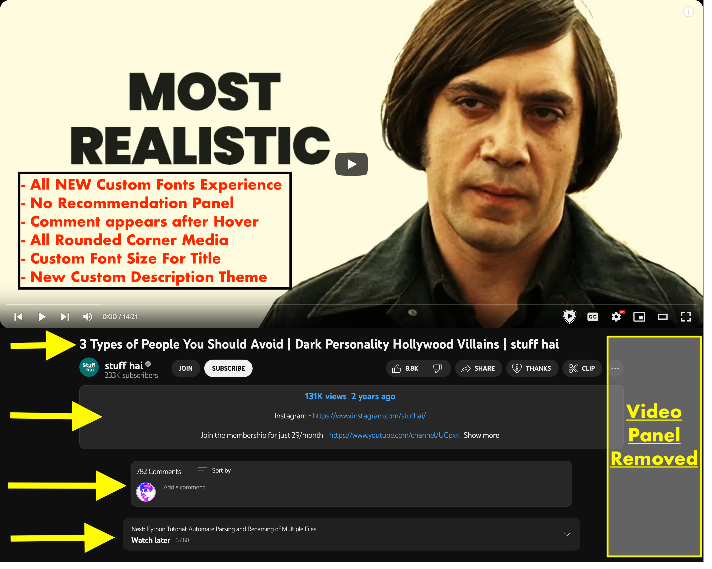
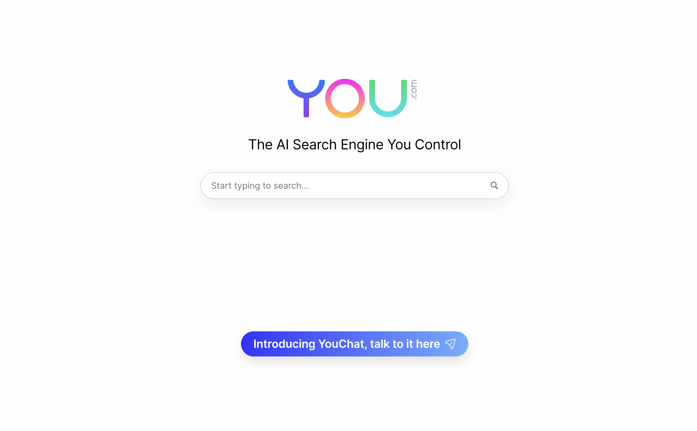
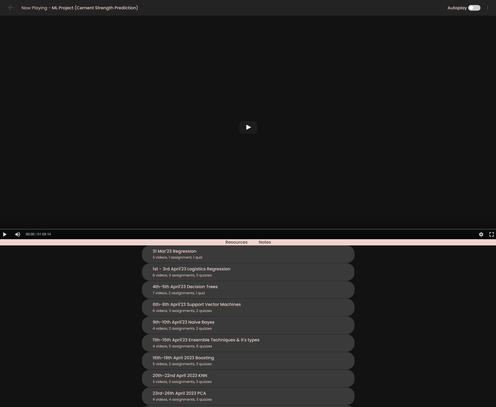

# My Custom Styles Collection

#### 1. For [`Youtube.com`](https://youtube.com): [Distraction Free YouTube](YouTube.com/Distraction-Free-YT.css)

#### 2. For [`You.com`](https://you.com) (an AI based search engine): [Cleaned You.com](You.com/you.com.css)

#### 3. To change the Fonts of all website: [Font Changer](Font%20Changer/font-changer.css)

#### 4. Enhance the look of PW Skills while watching course videos.

> [!IMPORTANT]
> You need to change certain things in order to use this custom theme or style.

### My Stylus Profile [here](https://userstyles.world/user/arv_anshul)
