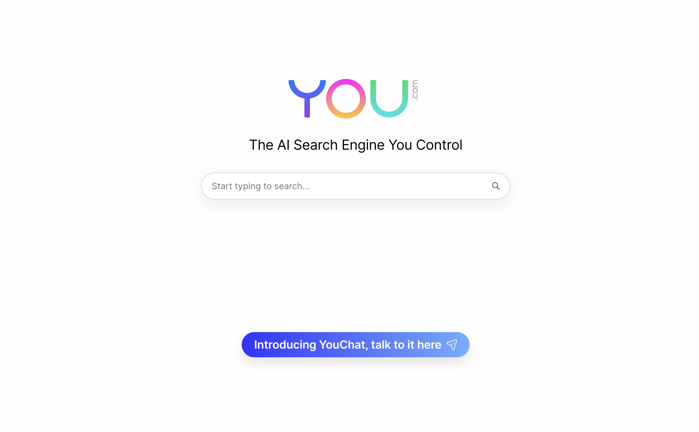

# My Custom Styles Collection

## Contents

#### 1. For [`Youtube.com`](https://youtube.com): [Distraction Free YouTube](YouTube.com/Distraction-Free-YT.css)  

#### 2. For [`You.com`](https://you.com) (an AI based search engine): [Cleaned You.com](You.com/you.com.css) 

#### 3. To change the Fonts of all website: [Font Changer](Font%20Changer/font-changer.css)

# Created by [arv-anshul](https://github.com/arv-anshul)

## For more custom styles.

### My Stylus Profile [here](https://userstyles.world/user/arv_anshul)

## :star2: This repository for future use.
